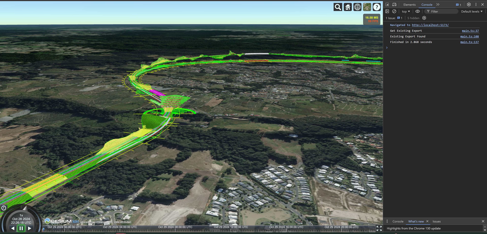

# Mesh Export Service - Cesium Viewer Integration Sample

This sample is an example of integrating the Mesh Export Service into a stand alone Cesium viewer. The goal of the sample is to view an iModel exported from the Mesh Export Service as a Cesium 3D Tiles tileset in the Cesium viewer. This demo runs with Vite and opens a local host server which displays the Cesium viewer and your iModel.

## Set Up

To run the sample, you will first need to pull the source code and set up your environment. You will need a Cesium Ion Token, an iModel Id associated with the imodel you wish to view, and a Client Id for a Single Page Application created on [developer.bentley.com](https://developer.bentley.com). Optionally, you can also specify a changeset Id to view a specific changeset of a specific iModel.

### 1) Obtaining the Cesium Ion Token

You will need a free Cesium Ion account to obtain this access token.

- First, follow the instructions on [this page](https://cesium.com/learn/ion/cesium-ion-access-tokens/) to learn how to create and obtain a Cesium Ion Access Token
- Next, in the sample's root directory, create a file named `.env`
- Create an environment variable named `VITE_ION_TOKEN`, and assign your acquired access token to it
    - The first line of your .env file should now look like this: `VITE_ION_TOKEN = "your-ion-token-here"`

### 2) Obtaining the iModel Id

You will need to obtain the iModel Id for the iModel you wish to view. You must use an iModel which you have access to at developer.bentley.com.

- First, sign in to [developer.bentley.com](https://developer.bentley.com)
- Click on your profile in the top right of the page, and click "My iTwins"
- If you already have access to an iTwin containing an iModel you would like to view, you can skip to step 1b

#### 2a) Create a New iTwin containing a New iModel

- If you do not already have access to any models, or if you would like to make a new model, click "New"
- Enter a name for your iTwin, and click "Save"
- You will be taken into your new iTwin. Under "iModels", click "New"
- Enter a name for your iModel and select "Bentley Sample" under "Create iModel from"
- Click on the drop down menu under "Bentley iModel template" and pick any sample model from the list
    - Note: Due to the model's size, it is advised not to pick "Stadium" for this step
- Click "Save"
- You will be taken back to your new itwin page, and your iModel should say "In Progress"

#### 2b) Saving iModel Id

- If you skipped creating a new iTwin and iModel, navigate into the iTwin you wish to use for this sample
- Find the iModel you wish to use for the demo, if you just created the iModel and it says "In Progress", wait for it to finish
- Click the three dots icon in the bottom right of your iModel, and then click "Copy Ids"
- An iTwin Id and iModel Id have now been copied to your clipboard. You only need to save the iModel Id, which is labeled "IMJS_IMODEL_ID"
- Now, back in your `.env` file, create an environment variable named `VITE_IMODEL_ID`, and assign your acquired imodel id to it
    - The next line of your .env file should now look like this: `VITE_IMODEL_ID = "your-imodel-id-here"`
- If you have a changeset id to specify, create an environment variable named `VITE_CHANGESET_ID` and assign the changeset id to it
    - This line of your .env file would now look like this: `VITE_CHANGESET_ID = "your-changeset-id-here"`

### 3) Obtaining the Client Id

- Navigate to [this page](https://developer.bentley.com/tutorials/register-and-modify-application/) which will show you how to register an application with Bentley.
- Follow the instructions on this page to register your application, with these important notes:
    - When prompted, choose to create a Single Page Application
    - When prompted, add this url as a "Redirect URI": http://localhost:5173
- Once the app is registered, copy the app's Client Id
- Now, back in your `.env` file, create an environment variable named `VITE_AUTH_CLIENT_ID`, and assign your acquired client id to it
    - The next line of your .env file should now look like this: `VITE_AUTH_CLIENT_ID = "your-client-id-here"`

## Running the Sample

To run the sample: 
- In a command prompt navigate to the sample's root directory
- run `npm run build`
- run `npm run dev`
- Navigate in your browser to https://localhost:5173

## What the Sample Does

As soon as you navigate to the local host url, the sample will start. In the developer console, the sample will output each step and then how long it took the sample to complete. The sample will:

- First, attempt to sign in using Bentley's authentication process
    - You might need to follow some prompts here to allow access to the Mesh Export Service
- Once authentication is successful, check if a Cesium export already exists for the iModel you provided
- If an export exists, obtain the url to the tileset for the existing export
- If an export does not already exist the demo will:
    - Start a Cesium export for the iModel you provided using the start-export API
    - Next, every five seconds, contact the Mesh Export Service and obtain the export's status using the get-export API
    - Next, once the export is complete, obtain the url to the tileset for the completed export
- Finally, display this tileset in the viewer using this url

Screenshot of a tileset after running the sample:

