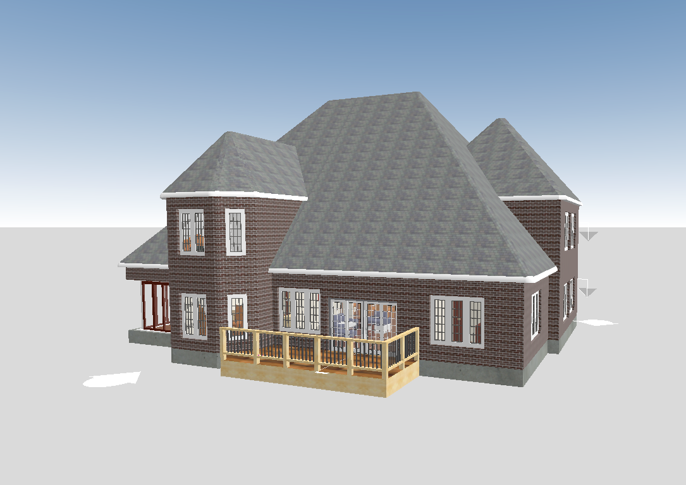

# threejs-3d-tiles-sample

This is a sample that demonstrates how to view a tileset in the [Cesium 3D Tiles](https://github.com/CesiumGS/3d-tiles) format from the iTwin platform [Mesh Export API](https://developer.bentley.com/apis/mesh-export/overview/) in [three.js](https://threejs.org/). This is done using [3DTilesRendererJS](https://github.com/NASA-AMMOS/3DTilesRendererJS/tree/master), a package that implements a three.js renderer for 3D Tiles. You can also find a detailed tutorial below for how to reproduce this sample.

## Steps to run

In the root directory:

- `npm install`
- `npm run build`
- `npm run dev`

## Environment variables

In a .env file in the root directory:

- `VITE_CLIENT_ID` - Client ID needed to sign in with Bentley IMS (required)
- `VITE_IMS_PREFIX` - Bentley IMS authority prefix (should be "dev-", "qa-", or "") (optional, default is "", meaning iModels in the production environment)
- `VITE_IMODEL_ID` - iModel ID of the iModel to view (required)
- `VITE_CHANGESET_ID` - Changeset ID of the changeset to view (optional, default is the latest changeset)

## Tutorial

### 1. Set up your application

This project uses Vite and Typescript, but you can use Webpack or another build tool, and either Typescript or vanilla Javascript. Please read the [three.js installation guide](https://threejs.org/docs/index.html#manual/en/introduction/Installation) for the three.js prerequisites and basic project structure.

This project was created with [this Vite guide](https://vite.dev/guide/#scaffolding-your-first-vite-project) and their `vanilla-ts` template, which worked well in combination with the three.js docs.

### 2. Create your three.js scene

Add the following to your `main.ts` file to import three.js and create a basic scene, camera, and renderer:

```typescript
import * as THREE from "three";

const scene = new THREE.Scene();
const camera = new THREE.PerspectiveCamera(75, window.innerWidth / window.innerHeight, 1, 100000);
camera.position.set(20, 6, 20);
const renderer = new THREE.WebGLRenderer();

renderer.setSize(window.innerWidth, window.innerHeight);
document.body.appendChild(renderer.domElement);
```

You might want the camera in a different position depending on the size of your tileset.

Now add the following to add some lights, controls, and a skybox to the scene:

```typescript
import { OrbitControls } from "three/addons/controls/OrbitControls.js";
import { createSimpleSky } from "./sky";

// Add lighting and skybox
const directionalLight = new THREE.DirectionalLight(0xffffff, 2);
directionalLight.position.set(1, 1, 0);

const hemisphereTop = 0xffffff; 
const hemisphereBottom = 0xaaaaaa;
const hermisphereIntensity = 2;
const hemisphereLight = new THREE.HemisphereLight(hemisphereTop, hemisphereBottom, hermisphereIntensity);
hemisphereLight.position.set(0, 1, 0);
scene.add(directionalLight, hemisphereLight);

const sky = createSimpleSky();
scene.add(sky);

const controls = new OrbitControls(camera, renderer.domElement);
```

At least one light is required to see the model in your scene, and adding both a hemisphere and directional light allow you to see basic shading. The controls are needed for navigating in the scene. You'll also notice we also added a new file called `sky.ts` with a function `createSimpleSky` which returns a basic skybox made of a three.js sphere geometry. Please refer to that file for the code.

### 3. Add Bentley iTwin authorization

To make requests to Mesh Export endpoints, you will need to provide an access token in the `Authorization` header. To obtain the access token, you need to register your app with the iTwin Platform to obtain a client ID. See [this documentation](https://developer.bentley.com/apis/overview/authorization/) to learn more about iTwin authorization and how to register your app.

Once you have a client ID, you can install the `@itwin/browser-authorization` package:

```console
npm i @itwin/browser-authorization@0.5.1
```

You can learn more about this package and other iTwin authorization clients [here](https://github.com/iTwin/auth-clients/tree/main).

Now add the following code, also to `main.ts`, to configure your authorization client and allow users to sign into the app:

```typescript
import { BrowserAuthorizationClient } from "@itwin/browser-authorization";

const redirectUri = window.location.origin + window.location.pathname;
const imsPrefix = import.meta.env.VITE_IMS_PREFIX || "qa-";

const authClient = new BrowserAuthorizationClient({
  authority: `https://${imsPrefix}ims.bentley.com`,
  clientId: import.meta.env.VITE_CLIENT_ID,
  scope: "itwin-platform",
  redirectUri,
  responseType: "code"
});

authClient.signInRedirect();
await authClient.handleSigninCallback();
```

This code assumes you have set the environment variable `VITE_CLIENT_ID` to your app's client ID in an .env file at your project's root directory. It also uses the optional `VITE_IMS_PREFIX` environment variable to determine which environment to use, but sets the default to QA.

Another important aspect to note is the `redirectUri` property of the auth client. This URI must be present in the redirect URIs setting where you created your app (in the same location where you got your client ID) on developer.bentley.com. For example, if you run your Vite development server on its default port 5173, `http://localhost:5173/` must be a redirect URI in your app's settings.

In the following step you will be using the auth client to get an access token.

### 4. Get your tileset.json from the Mesh Export API

Now that you are able to authorize with the service, add the following code to a new file `iModelTiles.ts` to create a function that gets an export from the Mesh Export API:

```typescript
export async function getIModel3dTilesUrl(iModelId: string, changesetId: string, imsPrefix: string, accessToken: string): Promise<URL | undefined> {
  const headers = {
    "Authorization": accessToken,
    "Accept": "application/vnd.bentley.itwin-platform.v1+json",
    "Content-Type": "application/json",
    "Prefer": "return=representation"
  };

  let url = `https://${imsPrefix}api.bentley.com/mesh-export/?iModelId=${iModelId}&exportType=3DTILES`;
  if (changesetId) {
    url += `&changesetId=${changesetId}`;
  }

  const response = await fetch(url, { headers });
  const responseJson = await response.json();
  if (responseJson.error) {
    throw new Error(responseJson.error);
  }

  // Get the first export from the response, if it exists
  const exportItem = responseJson.exports.shift();
  if (exportItem) {
    const tilesetUrl = new URL(exportItem._links.mesh.href);
    tilesetUrl.pathname = tilesetUrl.pathname + "/tileset.json";
    return tilesetUrl;
  }
}
```

This function uses the [get exports](https://developer.bentley.com/apis/mesh-export/operations/get-exports/) endpoint to get a list of exports in the 3D Tiles format. The export `exportItem`, contains a `_links.mesh.href` property which is the URL to the base path in Azure Storage that contains the tileset.json and its tiles. It's necessary to add the string "tileset.json" to the URL pathname to form it correctly.

Now to call this function in `main.ts`:

```typescript
const iModelId = import.meta.env.VITE_IMODEL_ID;
const changesetId = import.meta.env.VITE_CHANGESET_ID || "";

const accessToken = await authClient.getAccessToken();
const tilesetUrl = await getIModel3dTilesUrl(iModelId, changesetId, imsPrefix, accessToken);

if (!tilesetUrl) {
  throw new Error("Could not get tileset URL");
}

```

For this code snippet, you also need to set the environment variable `VITE_IMODEL_ID` to your iModel ID and `VITE_CHANGESET_ID` optionally to your changeset ID.

### 5. Set up the 3D Tiles Renderer

Now that you have your tileset.json URL, you can set up a `TilesRenderer` object from the 3DTilesRenderer package. Add the following code to add a renderer to your scene, as well as create a render loop function that updates the scene, camera, and controls:

```typescript
import { TilesRenderer } from "3d-tiles-renderer";
import { ITwinMeshExportServicePlugin } from "./ITwinMeshExportServicePlugin";

const tilesRenderer = new TilesRenderer(tilesetUrl.toString());
tilesRenderer.registerPlugin(new ITwinMeshExportServicePlugin(tilesetUrl.search));

tilesRenderer.setCamera(camera);
tilesRenderer.setResolutionFromRenderer(camera, renderer);
scene.add(tilesRenderer.group);

function renderLoop() {
  requestAnimationFrame(renderLoop);
  camera.updateMatrixWorld();
  tilesRenderer.update();
  controls.update();
  renderer.render(scene, camera);
}
```

You will notice there is a class called `ITwinMeshExportServicePlugin` that is imported and used, and in the next section we will explain how to create it. This is a plugin that customizes your `TilesRenderer` to handle the authorization requirements of the Mesh Export API. You need to call `registerPlugin()` and pass in an instance of `ITwinMeshExportServicePlugin`, with the tileset URL's query parameters passed into its constructor. Those query parameters contain the SAS token which is used to authorize and access the tiles and other resources.

### 6. Create the ITwinMeshExportServicePlugin

Create a new file called `ITwinMeshExportServicePlugin.ts` also in your `src/` folder, adjacent to `main.ts`. Add the following code to the file to create the `ITwinMeshExportServicePlugin` class:

```typescript
import * as THREE from "three";
import { TilesRenderer } from "3d-tiles-renderer";
import { GLTFLoader } from "three/addons/loaders/GLTFLoader.js";

export class ITwinMeshExportServicePlugin {
  name: string;
  sasToken: string;

  constructor(sasToken: string) {
    this.name = "ITWIN_MESH_EXPORT_SERVICE_PLUGIN";
    this.sasToken = sasToken;
  }
}
```

This class has two members: its name and the SAS token query parameters passed into the constructor. You can read more about 3DTilesRendererJS plugins [here](https://github.com/NASA-AMMOS/3DTilesRendererJS/blob/master/PLUGINS.md).

Next, add the following method to the class:

```typescript
appendSearchParams(url: string, searchParams: string) {
  const params = new URLSearchParams(searchParams);
  const newUrl = new URL(url);

  for (const [key, value] of params) {
    if (!newUrl.searchParams.get(key)) {
      newUrl.searchParams.append(key, value);
    }
  }

  return newUrl.toString();
}
```

This method takes a URL and query parameters as a string. It loops through the query parameters and adds them to the URL if it doesn't already contain them.

Now add the following methods, which make use of `appendSearchParams()`:

```typescript
init(tiles: TilesRenderer) {
  const manager = new THREE.LoadingManager();
  manager.setURLModifier((url) => {
    return this.appendSearchParams(url, this.sasToken);
  });

  const loader = new GLTFLoader(manager);
  tiles.manager.addHandler(/\.(gltf|glb)$/g, loader);
}

preprocessURL(uri: string) {
  if (/^http/.test(new URL(uri).protocol)) {
    return this.appendSearchParams(uri, this.sasToken);
  }

  return uri;
}
```

`init()` is ran when the `3DTilesRenderer` is first initialized. In this method, you can create a new three.js loading manager and set it to have a [URL modifier](https://threejs.org/docs/#api/en/loaders/managers/LoadingManager.setURLModifier) which calls `appendSearchParams()`. You can then then create a new GLTF loader out of this manager, and use `addHandler()` to tell your `TilesRenderer` object to use your new loader for files with the `.gltf` or `.glb` extensions. This is what tells three.js to add your SAS token query parameters to the texture (or other resource) requests that are made when it's reading the tileset's tiles, which are in the GLTF format.

`preprocessURL()` is similar to `init()`. Just like three.js concept of a URL modifier, it is called within the `3DTilesRenderer` before resource requests are made from the tileset.json. So this is required to add your SAS token query parameters to tile requests themselves.

With this plugin added, your tileset from the Mesh Export API will be able to properly pass along its SAS token to authorize requests for all its resources.

### 7. Center and align your tileset for viewing

The last step is to make sure your tileset is visible to the camera and oriented correctly. Back in `main.ts` add the following code, which adds an event listener to position the tileset after it loads:

```typescript
tilesRenderer.addEventListener( "load-tile-set", () => {
  // Tilesets from the Mesh Export API are positioned on earth's surface, like Cesium Ion tilesets.
  // So here we orient it such that up is Y+ and center the model
  // Based on the 3DTilesRendererJS Cesium ion example: https://github.com/NASA-AMMOS/3DTilesRendererJS/blob/master/example/ionExample.js#L78
  const sphere = new THREE.Sphere();
  tilesRenderer.getBoundingSphere(sphere);

  const position = sphere.center.clone();
  // Get distance from origin to the center of the tileset bounding sphere
  const distanceToEllipsoidCenter = position.length();

  // Get the direction of this vector, which should be "up" in the model, as it's sitting on earth's surface
  // Aka surfaceDirection is the surface normal
  const surfaceDirection = position.normalize();
  const up = new THREE.Vector3(0, 1, 0);
  const rotationToNorthPole = rotationBetweenDirections(surfaceDirection, up);

  tilesRenderer.group.quaternion.x = rotationToNorthPole.x;
  tilesRenderer.group.quaternion.y = rotationToNorthPole.y;
  tilesRenderer.group.quaternion.z = rotationToNorthPole.z;
  tilesRenderer.group.quaternion.w = rotationToNorthPole.w;

  tilesRenderer.group.position.y = -distanceToEllipsoidCenter;
});
```

As the first comment in the code explains, the Mesh Export API produces tilesets that are positioned on the Earth's surface. However, the three.js viewer does not contain a globe like the iTwin or Cesium viewer, so without any transformations the Mesh Export tilesets will be far from the three.js origin and harder to work with.

The first step in this code is to get the center of the tileset's bounding sphere to get its position in space. You can then get the distance from the origin to this position by getting the position vector's length, stored in `distanceToEllipsoidCenter`. You can also normalize the position to represent the surface direction of the Earth where the model is located-- this can be thought of as which direction is "up" for the orientation of the model, while "up" for three.js is the positive Y axis. You can then get the rotation between these two up directions as a quaternion using the `rotationBetweenDirections()` function, and set the tileset's `quaternion` property to it.

Add this code to define `rotationBetweenDirections()`:

```typescript
function rotationBetweenDirections(dir1: THREE.Vector3, dir2: THREE.Vector3) {
  const rotation = new THREE.Quaternion();
  const a = new THREE.Vector3().crossVectors(dir1, dir2);
  rotation.x = a.x;
  rotation.y = a.y;
  rotation.z = a.z;
  rotation.w = 1 + dir1.clone().dot(dir2);
  rotation.normalize();

  return rotation;
}
```

This code calculates the rotation between two directions by finding their cross product. All of the centering and rotation code from this step is from the [3DTilesRendererJS Cesium ion example](https://github.com/NASA-AMMOS/3DTilesRendererJS/blob/master/example/ionExample.js).

After this step, you should be able to view your tileset!


